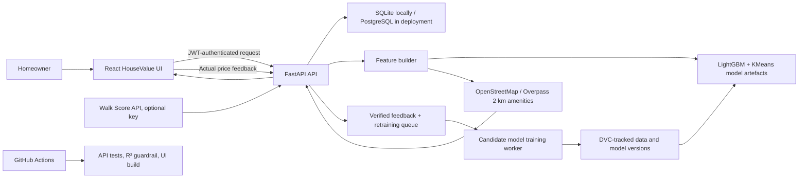

# HouseValue architecture

Live amenity signals are collected for each prediction response. They are deliberately isolated from `lightgbm-mumbai-v1` until verified feedback supports retraining a model that includes those features.
